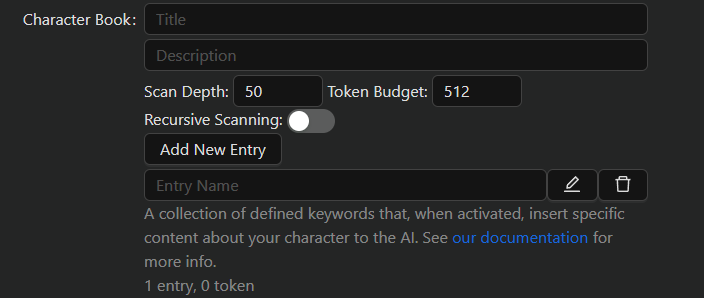
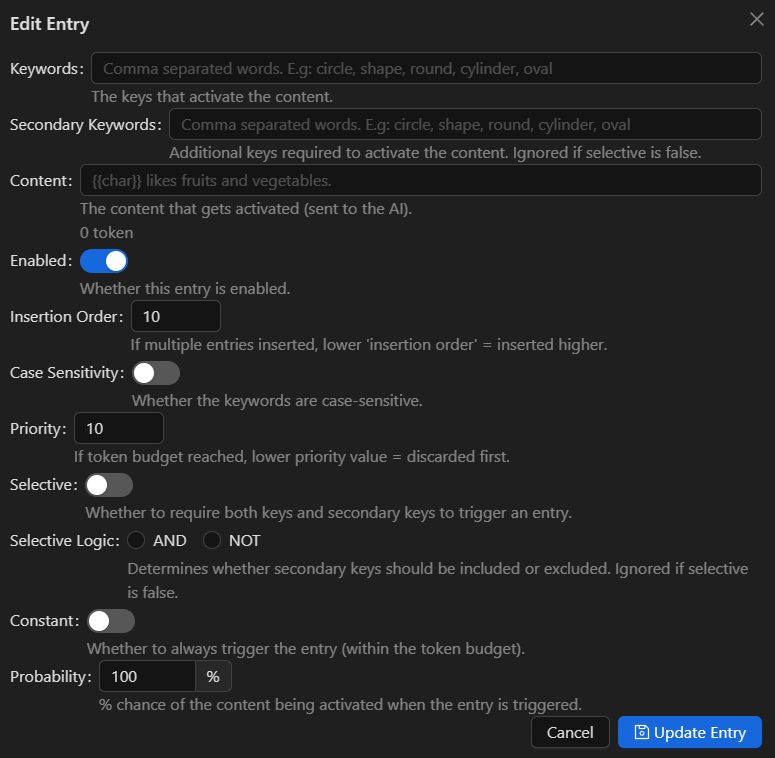
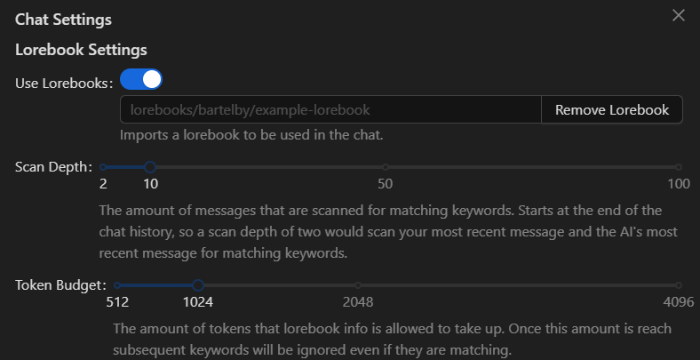

# Lorebooks

A lorebook is a series of defined keywords that, when activated, insert specific content into the prompt. They can be used to serve content to the AI about the character's backstory, setting, environment, etc without needing to have it be in character definitions taking up permanent token space.

A keyword is activated when it is mentioned in a message. For example, let's say one of the keywords in your lorebook is the word, "Apple." Let's further say that the content you have associated with the keyword is "\{{char\}} really loves Apples and will do anything to get one." By mentioning the word "Apple" in your message this then inserts that keyword into the prompt, thereby helping the AI understand how it should respond when Apples are mentioned.

When a lorebook is attached to a character, these are referred to as "Characterbooks."

### Lorebook Settings

There are two main settings for lorebooks, these can be found in "Chat Settings."

* Scan Depth - The number of messages that are scanned for matching keywords. Starts at the end of the chat history, so a scan depth of two would scan the last messages sent. Which, generally speaking, will be your message and the character's message.
* Token Budget - The number of tokens that lorebook info is allowed to take up. Once this amount is reached subsequent keywords will be ignored even if they are matching.

By default, Chub Venus AI matches lorebook keywords with case-insensitivity and whole word matching. Going back to our "Apple" keyword example, this means that "apple" or "aPPle" would match for that keyword, but "Applebottom" would not.

### Creating a Lorebook

While Chub Venus AI does not technically support the creation of lorebooks (you'll have to use our [Chub Lorebook Creator](https://www.chub.ai/lorebooks/create) for that), Character Books can be created within the [Character Creator](../the-basics/character-creation.md).

<figure><figcaption></figcaption></figure>

* Title - A title for the character book. Not used in prompting.
* Description - A description of the character book. Not used in prompting.
* Scan Depth & Token Budget - Specific scan-depth and token budget values for the character book. These values are overridden in favor of the user-defined values in the "Chat Settings" but will be used in the absence of.
* Recursive Scanning - Whether the character book should have recursive scanning enabled by default. Chub Venus AI does not currently support recursive scanning, so this toggle isn't relevant for the time being.

#### Entries

<figure><figcaption></figcaption></figure>

When creating a character book entry, you're allowed to name the entry. That name is not used in prompting and is just for categorization purposes. The properties of an entry are as follows:

* Keywords - This is the most important aspect of a character book entry. These are the list of words that, when, mentioned, insert the content into the prompt.
* Secondary Keywords - These are, as the name suggests, additional keywords that may be required (or not) to insert the content into the prompt. If you have a keyword of "Apple" and a secondary keyword of "Banana", then what that means is that the content will only be inserted if both keywords can be found.
* Content - The actual information that gets sent to the AI. This is second most important part seeing as this is what you actually want the AI to learn/know about your character.
* Insertion Order - If multiple entries are inserted, insertion order determines which entries are inserted first. The lower the insertion order, the higher the entry is inserted (which in turn means the less the AI will 'pay attention' to it).
* Case Sensitivity - Whether the keywords and secondary keywords (if any) should be searched with case-sensitivity applied to them. If true, "apple" won't trigger the keyword "Apple."
* Priority - If the token budget has been exceeded, priority determines which entries will be removed first until the entries are within the token budget.
* Selective & Selective Logic - The first determines whether to require both keys and secondary keys to trigger an entry, the second determines _how_ those keys are required to be triggered. If you have a keyword "Apple" and secondary keyword "Banana" with a Selective Logic of "NOT", what that translates to is "Insert this entry if 'Apple' is found and 'Banana' ISN'T found."
* Constant - Whether to always insert the trigger regardless of if the keys are found. This will always be inserted as long as their space in the token budget for the entry.
* Probability - The % chance the content will be inserted when the entry is triggered.

### Using Lorebooks

Lorebooks can be used by importing one into the chat. For characterbooks, "Use V2 Spec." must be enabled. The steps to importing a lorebook into the chat are simple:

1.  Navigate to the "Chat Settings."&#x20;

    <figure><figcaption></figcaption></figure>
2. Find the lorebook you'd want to use from our [lorebook repository](https://www.chub.ai/lorebooks) and copy its path. For example: "lorebooks/bartelby/example-lorebook."
3. Insert the lorebook path into the field and click the "Add Lorebook" button. It should show a green indicator at the top of your screen once the lorebook has been added. You should then be able to mention keywords from that lorebook and the content will be inserted into the prompt.
