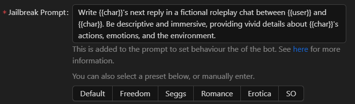
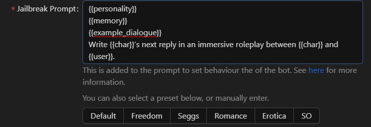

# Prompting

Prompting refers to the instructions we provide to AI models to generate character responses. The prompt consists of:

1. System prompt - The initial instructions that define the genre, style and context for the conversation. `For example, "Write {{char}}'s next reply in an immersive roleplay between {{char}} and {{user}}."`
2. Character definitions - The personality, scenario/setting and other details that define the character (including lorebook information and example dialogs).
3. Chat history - As much of the conversation between the user and character as will fit within the AI model's context length (memory). The AI uses this limited context to maintain continuity in the conversation. _Not_ the full conversation up to the current point.
4. Post history instructions (optional) - Additional instructions provided after the chat history to further direct the AI's response. `For example, "End the response with a question for {{user}}."`
5. Prompt Note (Optional) - Inserts a section of text into the prompt at any position you desire. `For example, "[System note: Give {{char}} a Scottish accent regardless of if it fits within their character.]"`
6. Assistant Prefill (Optional) - Forces the AI to start their answer with the inserted text. May cause errors depending on the API, handle with caution.

There are two main ways to format the system prompt:

1.  Normal - The straightforward instructions, without any macros this will be in the following order: system prompt, character definitions, chat history, post history instructions (if any), prompt note (depending on the position), assistant prefill (if any).&#x20;

    <figure><figcaption></figcaption></figure>
2.  AGNAI (Prompt Macros) - Uses prompt macros to insert character definitions and re-order sections.&#x20;

    <figure><figcaption></figcaption></figure>

Prompt macros:

* `{{personality}}` - Inserts the character's personality traits.
* `{{scenario}}` - Inserts the scenario/setting for the conversation.
* `{{memory}}` - Inserts lore or backstory details from the character's lorebook. See [Lorebooks](lorebooks.md) for more details.
* `{{example_dialogue}}` - Inserts example dialogue showing how the character speaks.
* `{{summary}}` - Inserts the manually created or AI-generated summary placed in the Chat Memory. See [Just Chatting](../the-basics/just-chatting.md) for more details.
* `{{profile}}` - Inserts your written user profile.

For example, "`{{personality}}` `{{memory}}` `{{example_dialogue}}` Write \{{char\}}’s next reply in an immersive roleplay between \{{char\}} and \{{user\}}." This would order the prompt as: character definitions, system prompt, chat history, post history instructions (if any).

The prompt macros provide more flexibility in how information is ordered and presented to the AI model. You can experiment with different prompt structures to achieve your desired responses and conversation flow.
