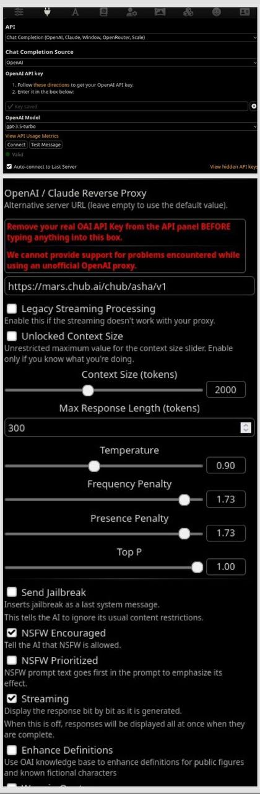
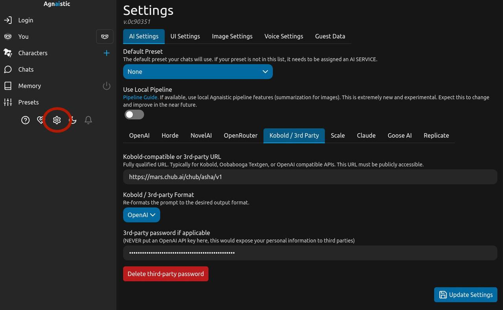
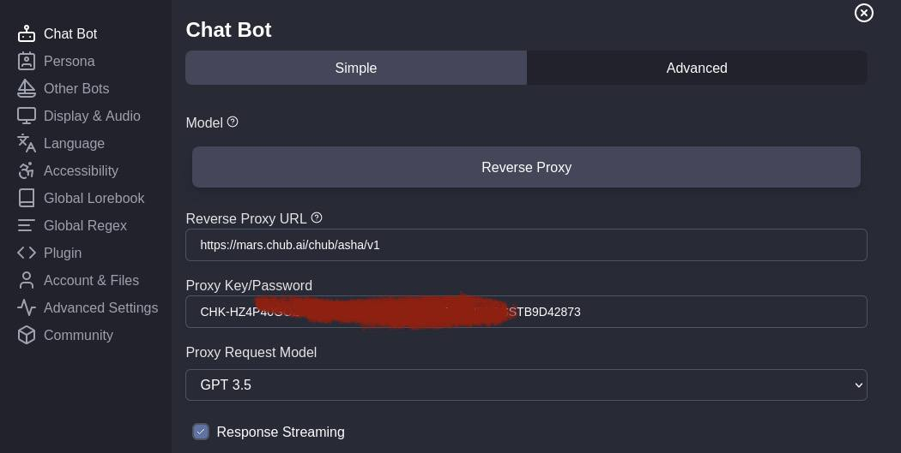
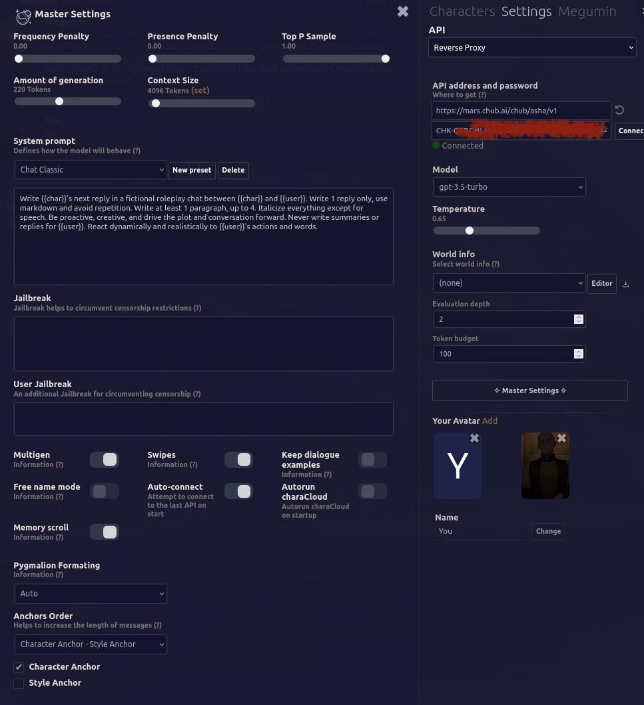
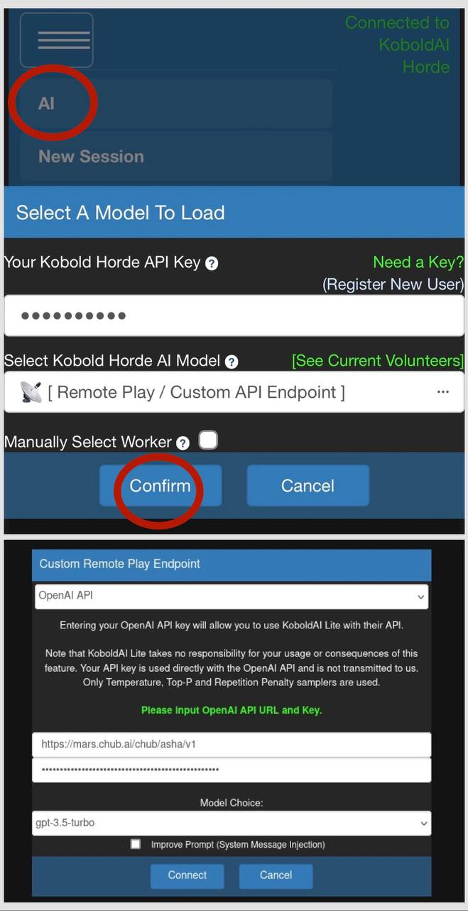

# Usage with Third-Party UIs

The Mars and Mercury APIs can be used in the same way as an OpenAI reverse proxy, and are compatible with any UI that supports them. Here are some configuration examples for various UIs.

(If you're looking for Swagger documentation for the API itself, see [https://inference.chub.ai](https://inference.chub.ai).)

<figure><figcaption>
SillyTavern example configuration
</figcaption></figure>

<figure><figcaption>
Agnaistic example configuration
</figcaption></figure>

<figure><figcaption>
Risu example configuration
</figcaption></figure>

<figure><figcaption>
Base Tavern example configuration
</figcaption></figure>

<figure><figcaption>
Kobold Lite example configuration
</figcaption></figure>
