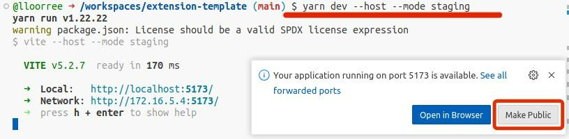

# 🛴 Optional: GitHub Codespaces

If you want, you can use GitHub Codespaces as an IDE.

* Go to the Stages Template at [https://github.com/CharHubAI/stage-template](https://github.com/CharHubAI/stage-template).
* Click on 'Use this template' -> 'Open in a codespace'.

<figure><figcaption></figcaption></figure>

* In the codespace that opens up, go to the terminal at the bottom and enter:

```
curl -o- https://raw.githubusercontent.com/creationix/nvm/v0.35.2/install.sh | bash
nvm install 21.7.1
yarn install
yarn dev --host
```

<figure><figcaption><p>The terminal's location in the Codespace window.</p></figcaption></figure>

* Follow the prompt to open the browser window. This is the running stage.&#x20;

<figure><figcaption></figcaption></figure>

* You can skip ahead to the other sections in this guide for a while to work on it, or go straight to the rest of the setup.
* To push your changes, go to 'Source Control' -> 'Publish Branch'

<figure><figcaption></figcaption></figure>

* A message will come up in the lower right with a link to the new project.

<figure><figcaption></figcaption></figure>

* For the build to submit to Chub, you'll have to [add an API key. ](optional-github-codespaces.md#adding-a-write-token)

## Adding an API Key

For your changes to push to Chub, you'll need to add a token to the secrets of your GitHub project. From the main page of your new project, go to 'Settings' -> 'Secrets and Variables' -> 'Actions' -> 'Repository secrets' -> 'New Repository Secret'.

<figure><figcaption><p>Where the settings tab is located on the GitHub page for your project.</p></figcaption></figure>

<figure><figcaption></figcaption></figure>

* Add the token with the name 'CHUB\_AUTH\_TOKEN'. You can get a write token from [https://chub.ai/my\_stages?active=tokens](https://chub.ai/my\_stages?active=tokens). &#x20;

<figure><figcaption></figcaption></figure>

* The next time you push, a stage project will be created in Chub and show up in your stages. To make this happen without a push, go to 'Actions' and rerun the failed push workflow:

<figure><figcaption></figcaption></figure>

<figure><figcaption></figcaption></figure>

<figure><figcaption></figcaption></figure>

#### That's it! Whenever you push changes, the GitHub Action will run and update the project in Chub.&#x20;

If you find the heavy comments in the template annoying, in any \*.ts\* file use the regex

```python
// .*|/\*\*\*.*?(\n|\r|.)*?\*\*\*/
```

in anything that supports regex editing (Intellij, et cetera) and delete them all.

In any \*.yaml, use:

```python
# .*
```

## In-Chat Live Coding vs the Test Runner

By default, when you run a stage in development, rather than waiting for a chat that may not exist it uses the test runner, which is in src/TestRunner.tsx. There are some example tests in the template, and the initialization data it uses is in src/assets/test-init.json.

If you'd rather edit with a live chat, it's most straightforward when running locally. Just add the stage to a chat in chat settings (you'll need to have pushed at least once so the stage exists), then hit 'Edit' and add the localhost URL.&#x20;

For a GitHub Codespace, it's slightly more involved. Run the project with the flag "--mode staging" set so that the TestRunner isn't run. When you do this, the corner popup has a button to 'Make Public' the running space. Press this.

<figure><figcaption></figcaption></figure>

If you miss this, you can change it in settings instead:

<figure><figcaption></figcaption></figure>

Once you're running locally or in the Codespace, go to "Chat Settings", hit 'Edit', and put in the URL.

<figure><figcaption></figcaption></figure>

If using a Codespace, you'll have to confirm before it will run. You may have to refresh the page after doing this.

<figure><figcaption></figcaption></figure>

#### Other Online IDEs

In theory a similar process would work with CodeSandbox as long as it was connected to your GitHub project and committed to it correctly, but it hasn't been tried and a guide written yet. If you have some other preferred platform, let us know.


