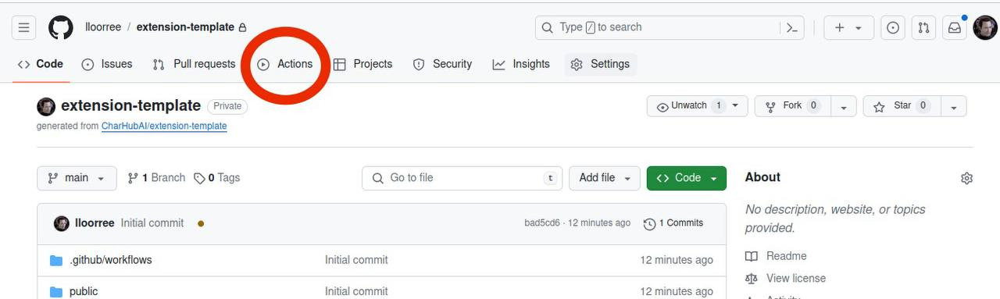
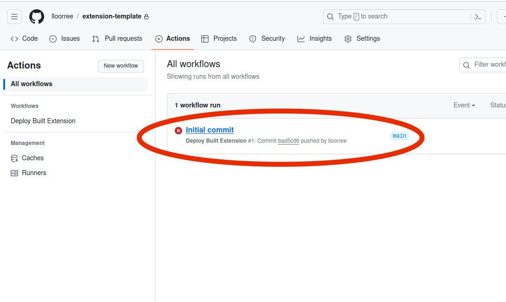

# ▶️ Quickstart / Setup

There are two main ways to develop a stage: locally or within a GitHub Codespace.

## Locally

### 1. Install node@21.7.1

<details>

<summary>Windows</summary>

1. Download and install nvm-windows from [https://github.com/coreybutler/nvm-windows](https://github.com/coreybutler/nvm-windows).

<!---->

2. Open a command prompt and run:

```
nvm install 21.7.1
nvm use 21.7.1
```

</details>

<details>

<summary>Linux and MacOS</summary>

```
curl -o- https://raw.githubusercontent.com/creationix/nvm/v0.35.2/install.sh | bash
nvm install 21.7.1
nvm use 21.7.1
```

</details>

### 2. Install yarn

```
corepack enable
yarn -v
```

### 3. Create a new repo using the template at [https://github.com/CharHubAI/stage-template](https://github.com/CharHubAI/stage-template) and download it.

<figure><figcaption></figcaption></figure>

```
git clone https://github.com/your-username/your-stage-name
cd your-stage-name
```

### 4. Run it.

```
yarn install
yarn dev --host
```

You should see this output on the command line, and this in a browser window.


* You can skip ahead to the other sections in this guide for a while to work on it, or go straight to the rest of the setup. To run in chat, you'll have to instead run:

```
yarn dev --host --mode staging
```

* When ready to push, for the build to submit to Chub, you'll have to [add an API key. ](quickstart-setup.md#adding-a-write-token)

## In-Chat Live Coding vs the Test Runner

By default, when you run a stage in development, rather than waiting for a chat that may not exist it uses the test runner, which is in src/TestRunner.tsx. There are some example tests in the template, and the initialization data it uses is in src/assets/test-init.json.

If you'd rather edit with a live chat, it's most straightforward when running locally. Just run with the command:

```
yarn dev --host --mode staging
```

Once you're running locally, go to "Chat Settings", hit 'Staging URL', and put in the URL and refresh the page. This will only work with the localhost version of the URL.

<figure><figcaption></figcaption></figure>

## Adding an API Key

For your changes to push to Chub, you'll need to add a token to the secrets of your GitHub project. From the main page of your new project, go to 'Settings' -> 'Secrets and Variables' -> 'Actions' -> 'Repository secrets' -> 'New Repository Secret'.

<figure><figcaption><p>Where the settings tab is located on the GitHub page for your project.</p></figcaption></figure>

<figure><figcaption></figcaption></figure>

* Add the token with the name 'CHUB\_AUTH\_TOKEN'. You can get a write token from [https://chub.ai/my\_stages?active=tokens](https://chub.ai/my\_stages?active=tokens). &#x20;

<figure><figcaption></figcaption></figure>

* The next time you push, a stage project will be created in Chub and show up in your stages. To make this happen without a push, go to 'Actions' and rerun the failed push workflow:

<figure><figcaption></figcaption></figure>

<figure><figcaption></figcaption></figure>

<figure><figcaption></figcaption></figure>

#### That's it! Whenever you push changes, the GitHub Action will run and update the project in Chub.&#x20;

If you find the heavy comments in the template annoying, in any \*.ts\* file use the regex

```python
// .*|/\*\*\*.*?(\n|\r|.)*?\*\*\*/
```

in anything that supports regex editing (Intellij, et cetera) and delete them all.

In any \*.yaml, use:

```python
# .*
```


