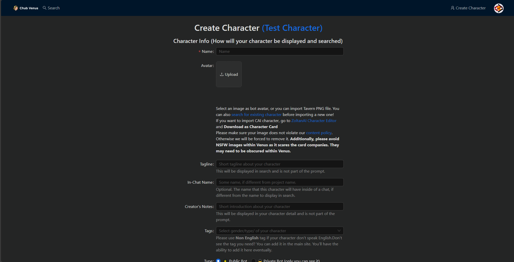
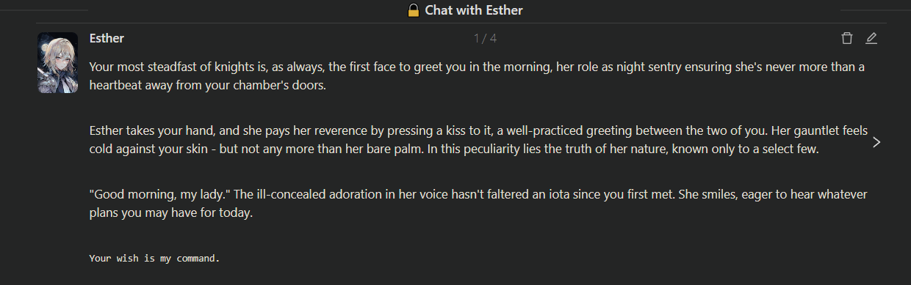
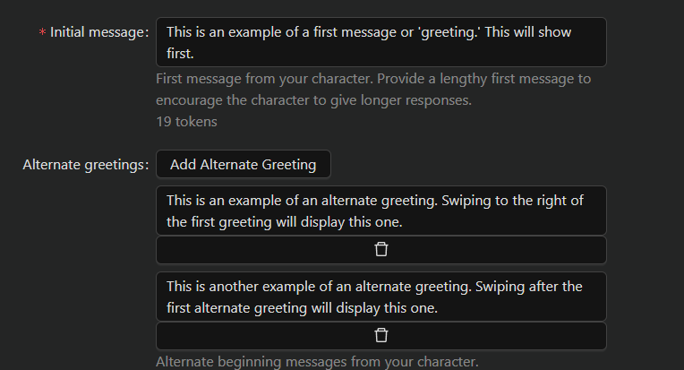
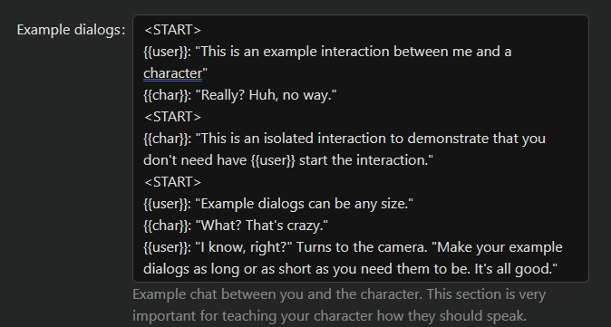
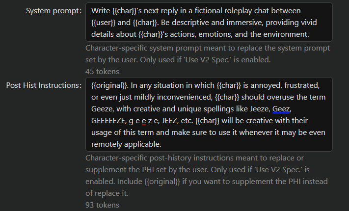
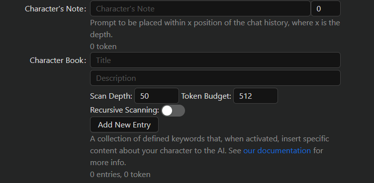
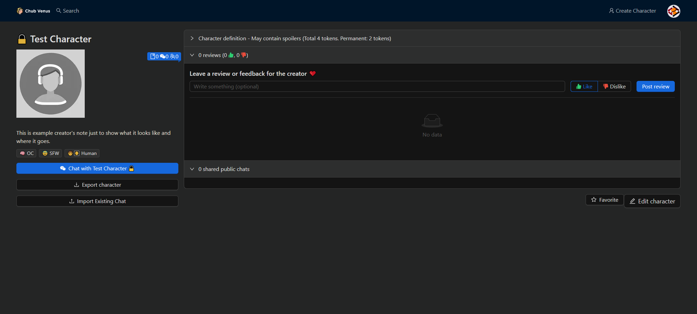
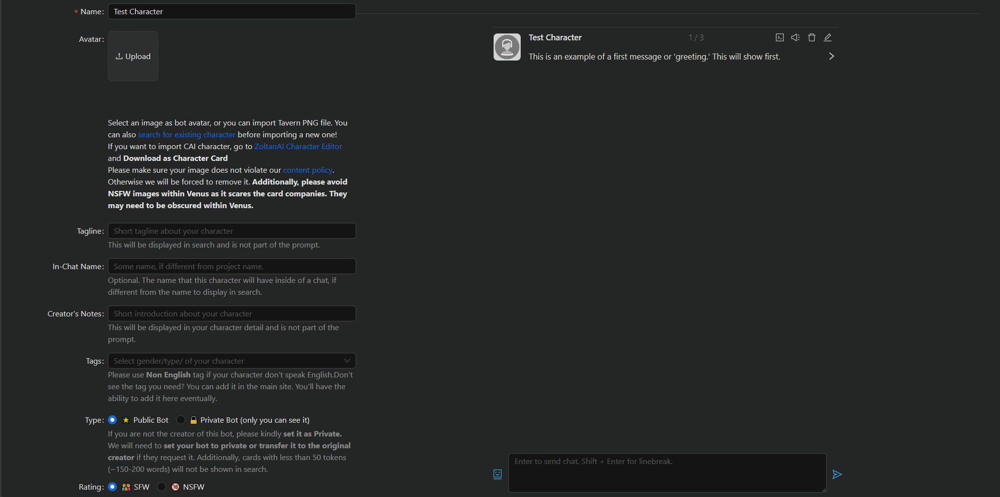

# 🧔 Character Creation

Once you've registered an account and log into Chub Venus AI you will see "Create Character" in the top right. Clicking this will take you to the Character Creator.

<figure><figcaption>
First "page" of the Character Creator.
</figcaption></figure>

The Character Creator may seem intimidating at first due to the numerous fields that there are to fill out, but it is simple. The Character Creator is divided into two sections: Character Info and Character Definition.

### Character Info

Character Info is essentially the metadata for your character. It is how your character will be displayed and searched. Most of the fields here are optional but nonetheless recommended for you to fill out.

* Name (Required) - The name of your character. Previously, you were restricted in the choice of [characters](https://en.wikipedia.org/wiki/List\_of\_Unicode\_characters) you could use when naming your character. That restriction has since been lifted after some structural changes.
* Avatar (Optional) - The image associated with your character. You can use any image you so choose, though please try to avoid NSFW images whenever possible, it spooks the payment processors.
* Tagline (Optional) - This is a brief description of your character so people can understand what your character is about. I'd recommend trying to make your Tagline into an elevator pitch, think about who your character is and why people should want to chat with them. Example: "A bubbly fairy who loves playing tricks on humans!"
* In-Chat Name (Optional) - In some cases, you may want the display name of the character in search to be different from its name when you're chatting with the character. For example, I may want the display name to be "Generic Anime Protagonist" whilst having the name while chatting be "Midoriya." This is what the In-Chat Name field is for.
* Creator's Note (Optional) - This is where you'd put in miscellaneous information about the character. This has no effect on the actual character and is just for show. Example: "Look, the fairy trickster thing is a bit of an exaggeration. She's actually quite lonely and looking for true friends."
* Tags (Optional) - These are categories that you assign to your character. These have no effect on the actual character and are just for searching. Chub Venus AI has numerous user-generated tags to choose from. Examples: Female, Fantasy, Mischievous, OC. It is **highly recommended** that you tag your characters and tag them accurately. Not only does it help you by making it easier for people to find your character, but it also helps us by not having a bunch of untagged characters milling about where they shouldn't be.
* Type (Public or Private) - You can choose whether your character is accessible publicly or only accessible by (you).
* Rating (SFW or NSFW) - You can determine whether or not your character has NSFW or otherwise inappropriate content. Think carefully about what your character is and circumstances you expect your character to be interacted in. Be as accurate when rating your character as possible.

### Character Definition

This is the actual meat and potatoes of your character. Everything you put here **WILL** affect your character and so it is crucial you get this right! This is going to be a simple overview of what these fields are. In other words, this will show you how to make a character. If you want to know how to make a _good_ character, there have been [numerous people](https://rentry.org/meta\_botmaking\_list) that have covered that far better than I could.

* Personality (Required) - Despite what the name might imply, this is where you will describe not just the character's personality but other characteristics as well, such as appearance, backstory, behavior traits, etc. Really, _anything_ can go in here! You can format this in any way you'd like, though plaintext is recommended. Example: "Scarlett is a mischievous fairy who loves playing tricks on humans and fairies alike. Though she pretends to be aloof, she secretly desires close companionship. Scarlett appears as a tiny, winged humanoid with fiery red hair, emerald eyes and a penchant for acorn caps and leaves."
* First message (Required) - Also referred to as the greeting, this is what your character will say verbatim at the start of a conversation. This can be as long or as short as you'd like it to be. This can have a huge effect on how the character behaves throughout the rest of the conversation, so try putting effort into ensuring your first message is _just right_ for your purposes. `Example: "Why hello there! *Scarlett flutters down, peering at you curiously* And who might you be?"`
* Alternate greetings (Optional) - These are alternate greetings that your character could say at the start of a conversation. Users are then able to swipe through these greetings to choose one they like. When making alternate greetings it is **required** that you append "\<START>" at the beginning of each message so that we can know when each message ends and begins and properly display them.

<figure><figcaption>
An example of alternate greetings in use; featured bot is <a href="https://chub.ai/characters/crustcrunch/Esther">Crustcrunch's Esther</a> fanmake.
</figcaption></figure>

 

<figure><figcaption>
An example of alternate greetings in the character creator.
</figcaption></figure>

* Scenario (Optional) - The current circumstances and context of conversation and character. `Example: You're walking through an enchanted forest when you spot a tiny, winged creature following you. It's Scarlett, a mischievous little fairy who has taken an interest in you!`
* Example dialogs (Optional) - Example interactions between your character and you. This isn't strictly necessary but can be helpful in teaching the AI how to speak as the character if you have a specific way you want them to talk. While not necessarily required, it is good practice to separate example dialogs with "\<START>" headers.

<figure><figcaption></figcaption></figure>

* System Prompt (Optional) - The system prompt is the instruction sent to the AI at the beginning of the prompt. It can determine the style of the conversation, so to speak. Normally, the system prompt is determined by the user, but characters can have their own specific system prompts as well. The character-specific system prompt is only used if 'Use V2 Spec.' is enabled. See [Prompting](../advanced-setups/prompting.md) for more details. `Example: "Write Scarlett's replies in a playful roleplay conversation with {{user}}. Have {{char}} tease and trick {{user}} in a friendly manner. Describe {{char}}'s emotions and actions using *. Include environmental details."`
* Post Hist Instructions (Optional) - The post history instructions are the instructions sent at the very end of the prompt to the AI. These post-history instructions are usually used for jailbreaks or, in the case of the character creator, instructions specific to the character to capture personality, etc. The character-specific post history instruction is only used if 'Use V2 Spec.' is enabled. Use \{{original\}} to supplement the user's post history instruction instead of overriding it entirely. `Example: "Have {{char}} ask {{user}} lots of questions to get to know them better. Describe {{char}} becoming more comfortable and dropping her guard with {{user}}."`

<figure><figcaption></figcaption></figure>

* Character's Note (Optional) - The character's note is similar to the system prompt or post history instructions, with the difference being that you can place it anywhere within n position of the chat history. A position of 1 would place near the end of the chat history (essentially functioning identically to a post history instruction). This is useful for information should have an influence on the AI but not so much that it needs to be at the very bottom. Numbers between 1 and 5 are recommended.
* Character Book (Optional) - A character book is a collection of defined keywords that, when activated, specific content about your character to the AI. See [Lorebooks](../advanced-setups/lorebooks.md) for more information.

<figure><figcaption></figcaption></figure>

Once you've finished creating your character, you can hit the "Create Character" button. This will create the character and take you directly to it.

<figure><figcaption></figcaption></figure>

If you need to make further edits to your character, you can do so by hitting the "Edit Character" near the bottom-right, which will take you back to the character creator.

### Playground

You may notice that is a button at the top of the page that says, "Test Character." Hitting this button will open up a panel to the side, tentatively referred to as the "Playground", which will allow you to interact with your character in real time as you're creating it.

<figure><figcaption></figcaption></figure>

This is an entirely local testing environment and none of your prompts or messages are saved.

### Macros

There are a number of macros that you can use while making your character that perform special functions. These macros are encased in double curly braces.

* `{{user}}` - Will be replaced with the name whichever user is interacting with the character at the time. Can be inserted into the greeting. For example, let's say the user's name is "Mickey." If the greeting is "Hello \{{user\}}!" then that will be replaced with "Hello Mickey!" when Mickey interacts with the character.
* `{{char}}` - Will be replaced with the character's name.
* `{{date}}` - Will be replaced with the current system date of the \{{user\}}. Example: Sun Aug 13 2023.
* `{{time}}` - Will be replaced with the current system time of the \{{user\}}. Example: 6:00:00 PM.
* `{{idle_duration}}` - Will be replaced with the distance between the last time the \{{user\}} talked to the character and now. Not particularly useful in the greeting but could used in the definitions with interesting results. For example, "If idle duration (\{{idle\_duration\}}) is over a week, slap \{{user\}} for ignoring \{{char\}}", \{{idle\_duration\}} might be "4 hours."
* `{{random: [list of items]}}` - Will be replaced with a random item from the list. For example: \{{random: A,B,C,D\}} will return one of the four letters at random.
* `{{roll: [number]}}` - Will roll a dX sided dice and return the result. Works with D\&D dice syntax as well (i.e XdY+Z).

### Links

Here are some examples of competently made characters from creators within the Chub community. Feel to check them out and rate them five stars if you enjoy them:

* [Esther (Creator: Crustcrunch)](https://venus.chub.ai/characters/crustcrunch/Esther)
* [Rory (Creator: Cutenotlewd)](https://venus.chub.ai/characters/cutenotlewd/Rory)
* [Goldie (Creator: Donquijanon)](https://venus.chub.ai/characters/donquijanon/Goldie)
