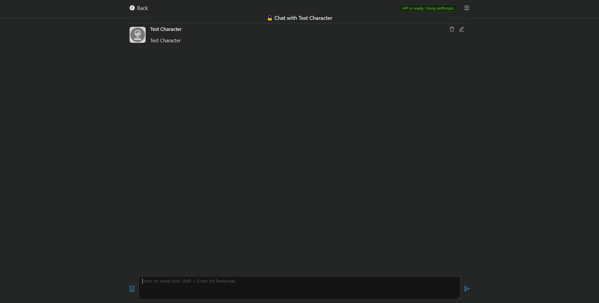
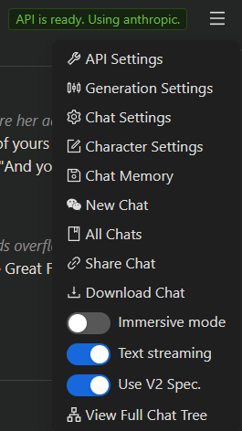
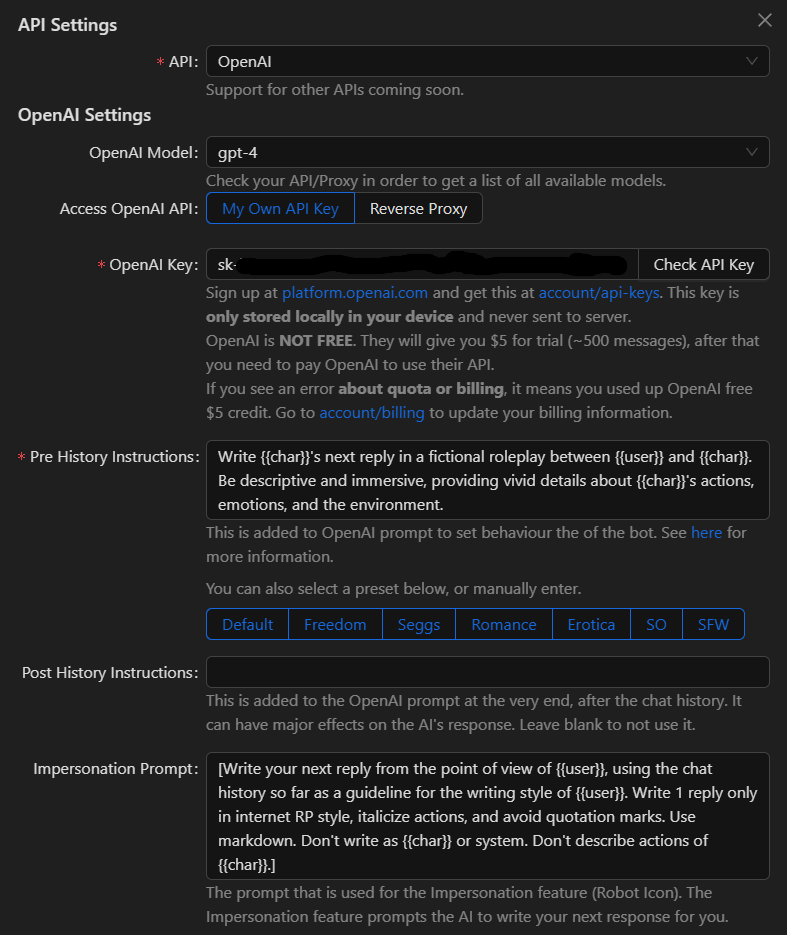
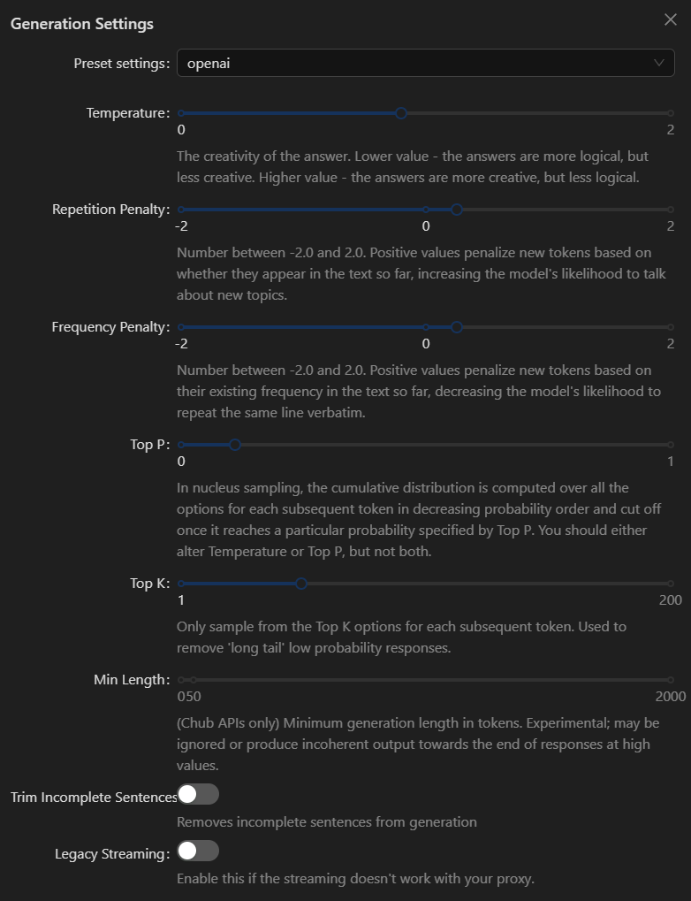
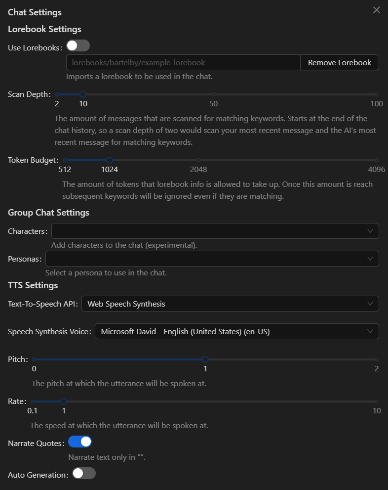
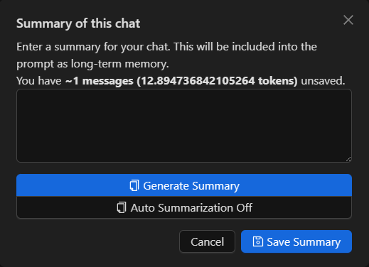
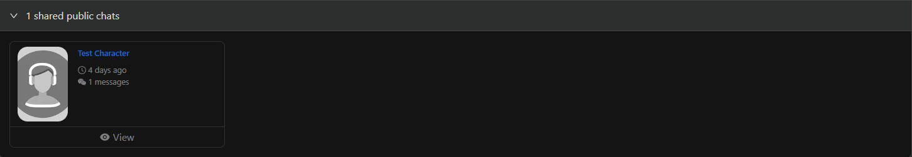
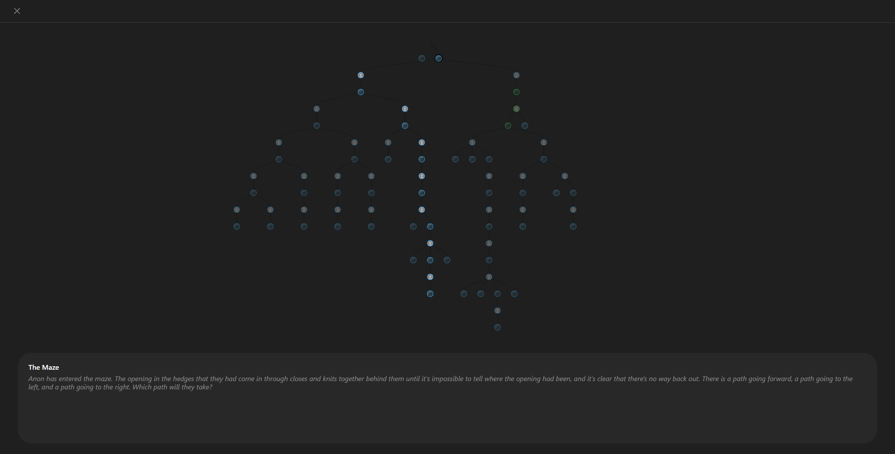

# 💬 Just Chatting

<figure><figcaption></figcaption></figure>

Once you've created a character or found one you like, you'll hit the blue "Chat with \[Character Name]" button to begin a chat with them.

<figure><figcaption></figcaption></figure>

Doing so will take you to the chat page, where you can already see a message from our Test Character that simply says, "Test Character." This is the first message I was referring to earlier. At the bottom left, near the If you click on the [hamburger button](https://en.wikipedia.org/wiki/Hamburger\_button) on the top right will bring down the options menu.

<figure><figcaption></figcaption></figure>

There are a number of features and settings to choose from, some of which will be covered more in-depth in later sections.

* API Settings - A necessary step before you can chat with a character. This is where you go to setup the API you'll be using to communicate as the character. See [API Connections](api-connections.md) for more details.

<figure><figcaption></figcaption></figure>

* Generation Settings - A series of parameters you can play around with to affect how the AI generates its responses as the character. Varies depending on the API you're using. See [API Connections](api-connections.md) for more details.

<figure><figcaption></figcaption></figure>

* Chat Settings - Where you can add a [Lorebook](../advanced-setups/lorebooks.md) to the chat, adjust its parameters, introduce additional characters to the chat, switch between roleplay profiles (personas), and setup text-to-speech.

<figure><figcaption></figcaption></figure>

* Character Settings - Here, you can make changes to the definitions of the character you interacting with, regardless of if it's your character or another's. Such changes only apply to your specific chat and nowhere else. These changes are stored on your local device's browser storage.

<figure><figcaption></figcaption></figure>

* Chat Memory - This is where you either manually enter a summary of the conversation thus far or have the AI generate one. Either way, the summary will be sent to the AI as additional context for the conversation. There's also the Auto Summarization feature which, when enabled, will auto-generate a summary each time a message is sent. When it comes to generating summaries, we use a method similar to the [Aisu Auto Summarizer](https://rentry.org/AisuAutoSummarizer). Meaning, we only summarize the messages that are out of context (aka messages that the AI no longer remembers).

<figure><figcaption></figcaption></figure>

* New Chat - Rather self-explanatory. Creates a new chat between you and the character.
* All Chats - Displays all the chats you've had with that character.
* Share/Unshare Chat - This will create a link to an anonymized version of the chat you had between you and the character that you can share with friends. The chat will also be viewable from the "shared public chats" section of that particular character. If you've accidently shared a chat or otherwise just want to make it private again, you can hit the button again.

<figure><figcaption></figcaption></figure>

* Download Chat - This downloads the **entire** chat history you've had with the character into a .jsonl file. This file can then be imported into other chat frontends such as [Agnai](https://agnai.chat/) or [SillyTavern](https://sillytavern.app/).
* Immersive Mode - Whether or not to remove elements that could distract from immersion such as the edit button or delete button.
* Text Streaming - Whether or not to display messages as they're being generated. Similar to ChatGPT or C.AI.
* Use V2 Spec. - Whether or not use a character's specific system prompt and post history instructions, as discussed earlier, if they exist. Also determines if the character's character book is used. See the [Character Card V2 specifications](https://github.com/malfoyslastname/character-card-spec-v2/blob/main/spec\_v2.md) for more details.
* View Full Chat Tree - Chub Venus AI is unlike **any other frontend out there** in that we support full tree branching of chats, similar to what you would get when using ChatGPT. This is useful if you want to go back and follow a different path if you like more than one swipe, or for making choose-your-own-adventure cards.

<figure><figcaption></figcaption></figure>
